# React + Vite

This template provides a minimal setup to get React working in Vite with HMR and some ESLint rules.

Currently, two official plugins are available:

- [@vitejs/plugin-react](https://github.com/vitejs/vite-plugin-react/blob/main/packages/plugin-react/README.md) uses [Babel](https://babeljs.io/) for Fast Refresh
- [@vitejs/plugin-react-swc](https://github.com/vitejs/vite-plugin-react-swc) uses [SWC](https://swc.rs/) for Fast Refresh

## Expanding the ESLint configuration

If you are developing a production application, we recommend using TypeScript and enable type-aware lint rules. Check out the [TS template](https://github.com/vitejs/vite/tree/main/packages/create-vite/template-react-ts) to integrate TypeScript and [`typescript-eslint`](https://typescript-eslint.io) in your project.

## why  postcss autoprefixer?

installed with : npm install -D tailwindcss postcss autoprefixer

1.  What is postcss?
==> PostCSS is a tool that transforms your CSS using JavaScript plugins.

Tailwind requires PostCSS because it generates all utility classes dynamically using it.

2.  What is autoprefixer?
==> Autoprefixer is a PostCSS plugin that adds vendor prefixes to CSS for better cross-browser compatibility.

3. Why needed in Tailwind?
==> When you run Tailwind CLI or use it with Vite, Tailwind is processed via PostCSS. So it looks for a postcss.config.js file with at least:

tailwindcss: {},

autoprefixer: {}

4.  postcss autoprefixer mandatory?

No, postcss and autoprefixer are not strictly mandatory to run Tailwind CSS, but they are recommended and often bundled by default because they improve compatibility and workflow.

5. So when can you skip them?

==> You can skip configuring PostCSS manually if you’re using tools like:

i. Next.js — built-in support

ii. Vite with Tailwind — 'tailwindcss init -p' handles it

iii. CRA (Create React App) — has PostCSS under the hood

## Made a counter- lifting state up:
--> if we want to scale it and used the <Counter> 2 times in the APP.jsx

both are encapsulated and doing separate state management

--> now if we want to show another component here <Stats> and show the sum of two <Counter> in <Stats>

here we need to pass the value of <Counter> as props

--> To do that we have to do lifting state up, means we have to lift the value of <Counts> to App.jsx component.

so i am creating an initial state

made the handling function in the App.jsx file and passed them as prop to the children components

--> all those things we have done before with context api

--> redux solves those state management problems

# why redux - Concept of redux?
1. performance optimization benefits**
2. to make  the application manageable
3. managing props drilling
4. scale the application easily

--> the things er did previously by lifting up the state:

here <Counter> is used only as a carrier

--> there can be more nested children, application can be complex with so many features

--> if we keep lifting state up, we have to break the tree structure every time 

--> some components becomes only carrier. they are not used in any way, not even using the props

- **How Redux helping?**

--> as we keep breaking the tree structure, **Redux** says let's not keep the state inside the tree structure

--> it keeps the state in another storage, the storage is like data warehouse

--> those components who need the state , will have to **subscribe** to the storage

those components can take data directly from the central store. -**this store is redux**

## What is Redux?
--> a third party library

--> Redux is a flexible -**state container** for javaScript apps that manages our applications state separately

--> redux is written a js and in any js project redux can be used (reactJS, vanillaJS, vueJS, angularJS, remix)

--> redux can also be used in backend with nodeJS

## How redux store works?
1. **action** : user interaction or action (ex:clicking a button) goes to redux as a command. this command is known as action in redux
2. **dispatch** : make the action to be happened 
3. **reducer()** : when any action happens (gets dispatched), how can we define the things that happened? in JS we can define occurred thing with function(). when any action will happen redux will call a function and do some work. that work / function is called **reducer**

## reducer()

scenario is: an action happened, we have state in redux store

--> reducer(state,action) function gets the state as 1st parameter and action as 2nd parameter automatically

reducer(state, action){

    return newState ;
    
}

--> after that, we will check the action , and based on action we will conditionally change the state

--> in the reducer() function there will be the logic

--> if the action is increment, we will do state update for increment, like this

--> finally reducer() changes the state and returns a new state; reducer does it **immutably**

--> **immutably**  means, reducer() never changes the main state; it just returns a new **updated** state; and does not mute the old state, as it has to keep the history

--> <Count> and <Stats> component **subscribed** in to redux. so when new updated state comes, redux gives the updated state to those subscribed components, so that they can use it.

## what are the redux terminology?

## setup the existed counter with redux terminology

--> when we setup redux we have to consider, with which feature we will be working

--> when a new feature will be added, we will be adding a redux feature

--> here we have only counter feature

-**RTK**

--> redux **toolkit** : also known as **RTK**, a newer technology 

--> not a package; combination of multiple packages

--> we can keep the code manageable with toolkit

-**installation**

npm install @reduxjs/toolkit

npm install react-redux

or, npm install @reduxjs/toolkit react-redux (together)

-**setup**

--> opened a feature folder in src folder, its a convention

--> the feature we have is counter, so we will open a folder counters in the features folder, here we will have some redux oriented files

--> another terminology comes here is **slice**

--> if the application is a pizza, every feature on it is a slice. so we need a slice for every feature. we will open a countersSlice.js file for counters.

--> in redux , while creating file we  can only keep js instead of jsx. because they are just normal javascript function 

--> **createSlice()** is a function provided by the react toolkit , with which we can create the slice

--> in the **createSlice()** there will be some options and we have to give the options in **object**

--> the first field in the object will be name . normally convention is folder name should be given as name

--> then we have to give the **initial state**

--> then we will have to give the **reducers** ; its also an **object**

--> **why reducers ; why not reducer ?** : there is one central reducer but in that reducer there are multiple separate functions.

    one function for increment and one for decrement. for every individual action there is separate function, so there are multiple functions

    we say reducers cz we can add multiple functions here. reducers will combine them and make them one. reducers is a indicator that now we can add there multiple functions.  

    

--> for counters we need two reducer here. as parameter there will be state and action.

--> as we have multiple counters , we have to get the counterId, we can get it by action.payload

--> in this case we can make the state muted by using **immer**. immer is already in the redux dependency.

increment and decrement are partial reducer function

--> we have to export it. here we can see it says reducer; not reducers anymore

--> we have to export the actions as well. actions number will be similar to the reducer , we will get the action name by the reducer name.

--> actions will be named export.

## now make the store

file creation: src --> app --> store.js

--> we will make the store with redux. by configureStore()

--> store only needs reducer 

## use the store

--> wrap the <App> component with provider form react-redux in the main.jsx file

--> pass the store as props in the provider

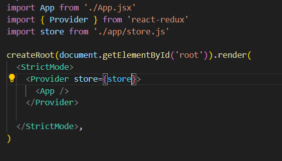

now the application knows that it's using redux

## if another feature comes ( like videos)

1. make the videoSlice
2. export the reducer from videoSlice
3. export the function creators
4. create the store with feature name
5. import the reducer and add it in the store
6. export  store

## subscribe to the store

--> react-redux package has given some hooks, by using them we can get data from the store

--> in the APP.jsx file we will use **useSelector()** hook to get the counters from the store

--> a call back pattern is a must in the useSelector(); and a state parameter must be added

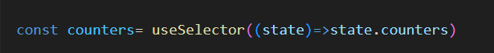

--> here the state is the whole reducer object. in that object we have the state of counters

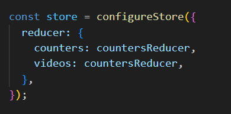

--> the reducer object is a state. in reducer .counters there is the state of 

--> that means the whole redux is single large javascript object. in that object there is counters property and in that property there will be counters object

## action dispatch
--> to dispatch the action we need a dispatcher hook - useDispatcher() provided by react-redux

--> the increment function that was named exported, is not any function. it's a function creator. means if i call the increment function it will return me an action

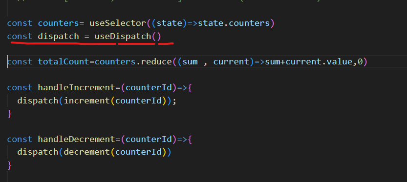

## overview:

## if another feature comes ( like videos)

1. make the videoSlice
2. export the reducer from videoSlice
3. export the function creators
4. create the store with feature name
5. import the reducer and add it in the store
6. export  store
7. get the data with selector in component
8. dispatch the action using dispatcher

# Redux debugging:

## redux dev tool setup:

--> in the application end we have used redux toolkit, so we don't need to do anything there

--> we just need to enable a **browser extension** for debugging

--> we have to install that browser extension

--> extension --> manage extension --> chrome web store --> search "redux dev tools"

--> add the extension

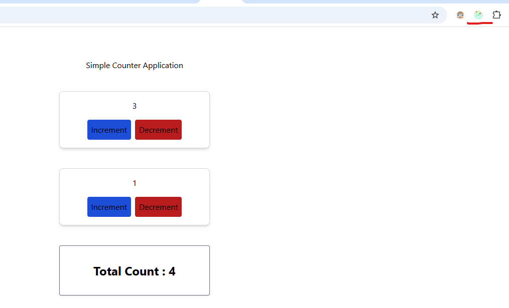

redux is used in this page, so the extension is colorful here as the application is in development process. in other pages it has no color

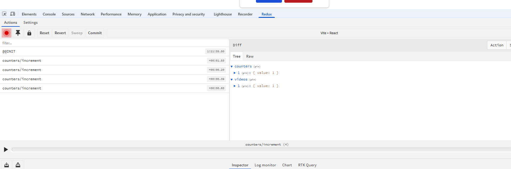

we can even see the redux debugging experience in inspect option

--> final state

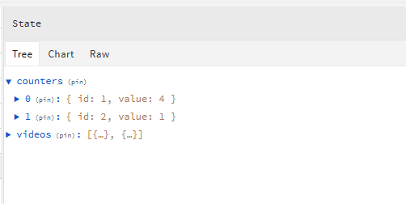

this counters comes from the store

--> we can see it in **chart form** also

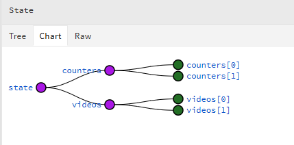

--> in **raw form**

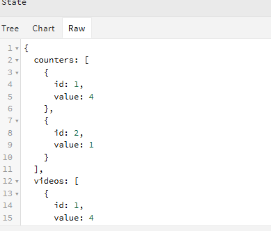

--> initial state situation

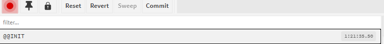

--> we can even track the code dispatch line

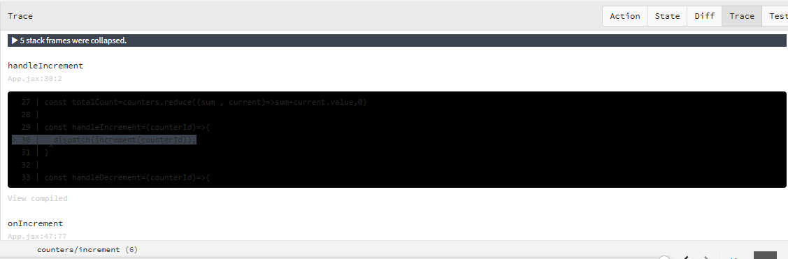

--> also jump to any previous state

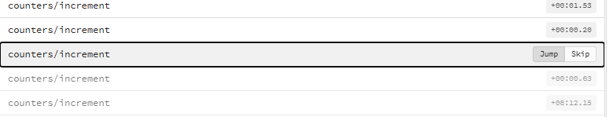

--> **video** : check on the actions and  state changing by video

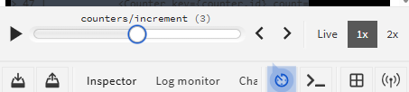

## asynchronous action: Redux thunk/ asynchronous thunk

--> redux store is synchronous. asynchronous work doesn't happen here

--> when we integrate an GET api  , it will take some time to req and fetch the data. but redux won't be waiting for that time, we have to give some synchronous action. now how can we handle this case?

1. when we click on a button,an action gets dispatched; it's not a real action, it's an asynchronous work
2. when that asynchronous   task will try to enter into the store there will be a middleware; it will work like a gatekeeper before going to the reducer
3. because after reaching to the reducer it's synchronous
4. that middleware will intercept
5.  when the middleware gets the response from the API , then it will create the actual action anf give it to the reducer.
6. the journey from the button to the middleware will asynchronous and synchronous journey will start when the middleware makes the action.
7. then the action will be sent to the reducer and the reducer will change the 

instead of action when sent and asynchronous task, its called **asynchronous thunk**

8. we won't call an **action creator** this time, we will call a **thunk function()**
9. that thunk function will go to the middleware and an action will be returned. 

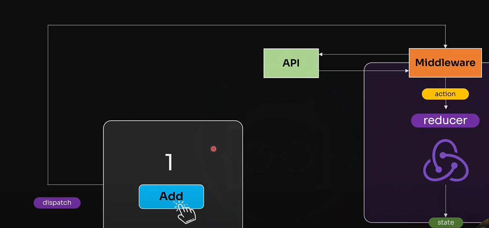

-**setup - create async thunk**:
1. lets get data from json placeholder
2. create a slice for posts
3. create an initial state
4. here we will use **extraReducers()** to handle asynchronous tasks
5. take **builder** as parameter. 
6. case will be handles by **builder.addCase()**

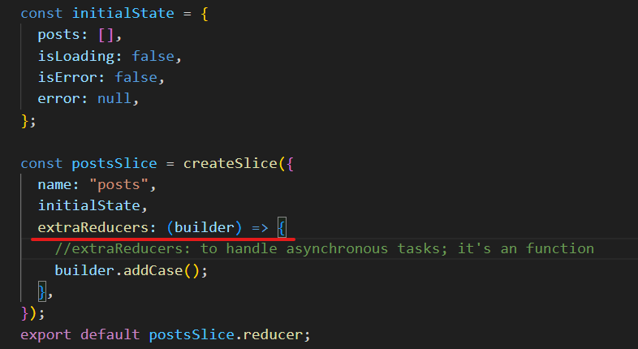

7. there can be 3 states- promise pending, fulfilled, rejected. we will handle those case using  builder.addCase()
8. to handle those cases we need to create the asyncThunk and give the name of the action as 1st 
9. in 2nd parameter we will give the function to call the API
10. we will fetch the data with API in separate file

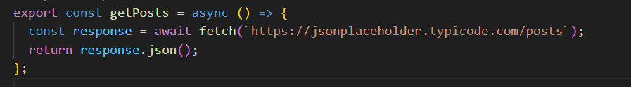

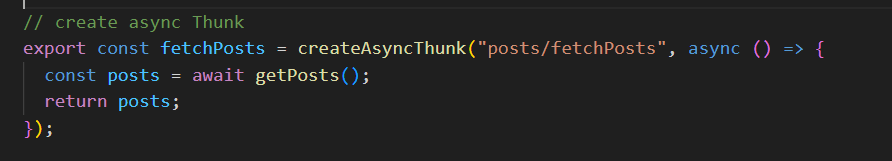

## write the case in builder.addCase()

--> there can be 3 state: pending, fulfilled and rejected

-**pending state**

pending state means loading state, to handle that state we will use a reducer

here we won't have any action , as to handle loading state we don't need action

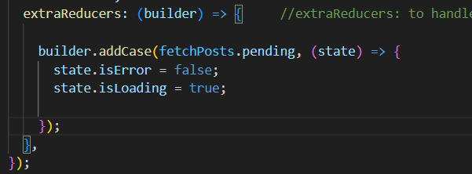

-**fulfilled state**

now we will need action because the actual data is in the action.payload

when the promise will be resolved then the reducer will give you the data in the acction.payload

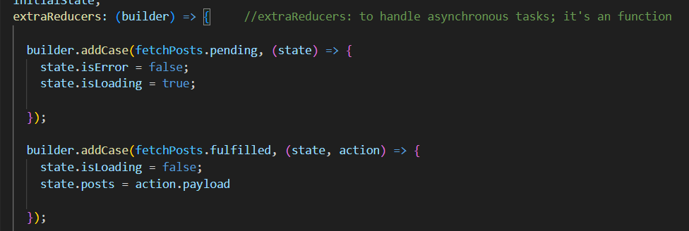

-**rejected state**

this time isError will be true

from the fetched data , it's possible that there is no error message. so we will add optional chaining.

when the data came , we got it in action.payload

but when the error happens , it will give the error in action.error

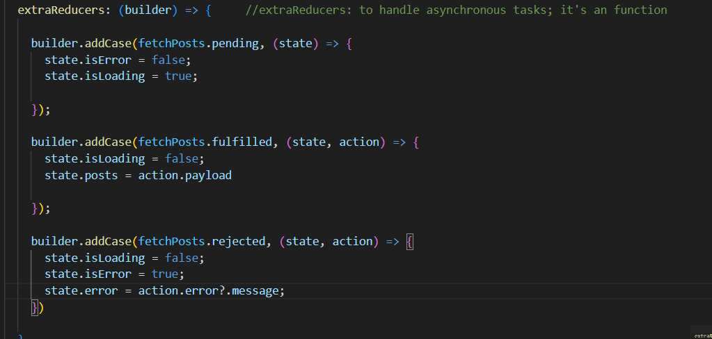

--> we can chain the builder parameter

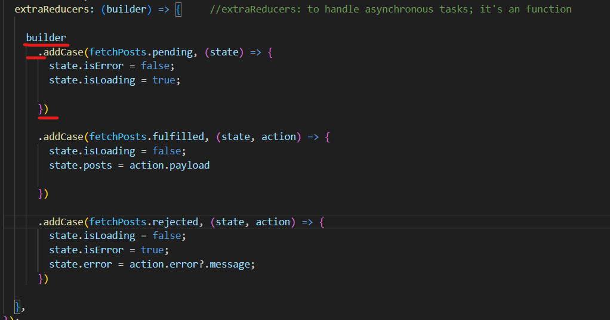

--> we don't have to export the action creator this time. beacuse when we called **createAsyncThunk()** creted action will be automatically given in **"posts/fetchPosts"**

--> and when we will try to do action dispatch from our react component , we will use the dispatch function, that time we will directly diapatch the thunk instead of action.

## Add feature in the store

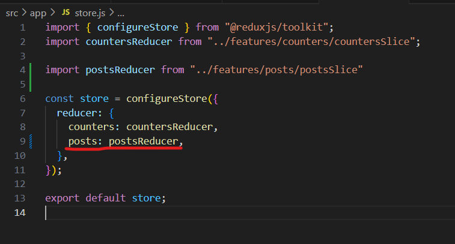

--> when we inspect 

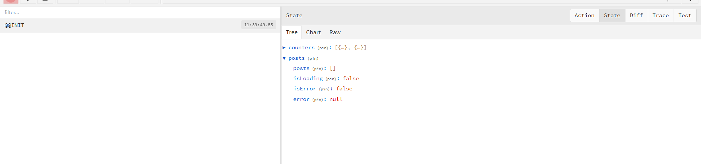

as we can see it in the initial state, we can say that out store setup is correct

## action dispatch in the ui

-**subscribe to the store** : using useSelector() and give the useSelector function as parameter

-**dispatch action**

as we don't have the data, for the side effect of data we have to use the useEffect

we also need the dispatch hook to dispatch the thunk inside the useEffect()

as the dependency we will add the dispatch function

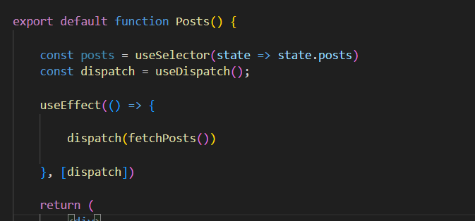

-**decide what to render**

--> now for the posts, sometimes it can be loading, it can be error or it can be data

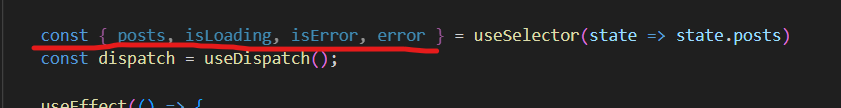

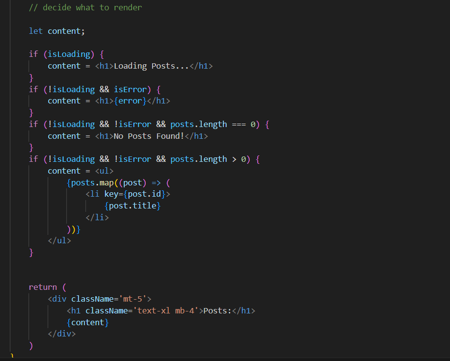

--> in redux dev tool

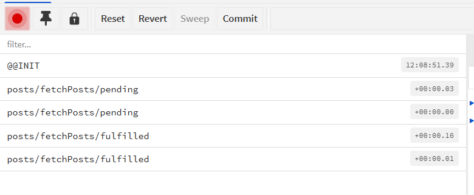

# what problem redux solves and how?

# new learnings:
## reduce()
to convert an array to a single value we use reduce()

--> sum is a number holding previous 

--> current is indicating to the current individual array value according to index

--> and the parameter 0 is the initial value of sum

# problems that I faced:

# tailwind css wasn't working:

-->Because

 ["./src/**/*.{html,js}"]

 -->solved by

 

["./index.html", "./src/**/*.{js,jsx,ts,tsx}"]

